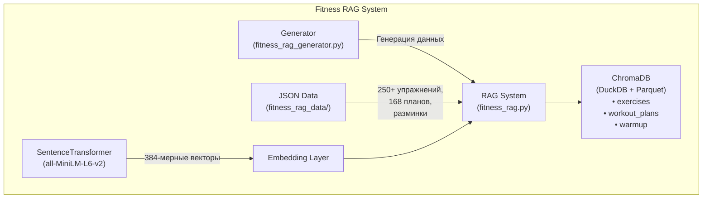
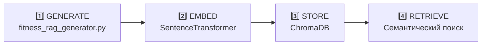

<div align="center">

# 🏋️ Fitness RAG System

[](https://python.org/)
[](https://www.trychroma.com/)
[](https://python.langchain.com/docs/modules/data_connection/retrievers/vectorstore)
[](https://www.sbert.net/)
[](https://github.com/)

**Персональный фитнес-тренер на базе RAG с ChromaDB**

[Особенности](#-особенности-системы) • [Установка](#-быстрый-старт) • [Использование](#-использование-rag-системы) • [JSON API](#-использование-json-данных-в-других-проектах) • [Заключение](#-заключение)

</div>

---

## 📋 Описание

**Fitness RAG System** — это персональный фитнес-тренер на базе архитектуры RAG (Retrieval-Augmented Generation). Система генерирует индивидуальные планы тренировок на 4 недели, используя векторную базу данных ChromaDB и семантический поиск через SentenceTransformer.

**Основные возможности**

- 🎨 **Генерация данных** — создаёт 250+ упражнений с ASCII-схемами, 168 тренировочных планов
- 🔍 **Семантический поиск** — поиск релевантных упражнений и планов по текстовым запросам
- 👥 **Персонализация** — 6 категорий пользователей (мужчины/женщины × 3 возрастные группы)
- 📈 **Прогрессия нагрузки** — интенсивность растёт каждую неделю (4 недели)
- 🏠 **Локальная работа** — без внешних API, всё хранится локально

---

## 🛠 Технологии

| Технология | Версия | Описание |
|------------|--------|----------|
| **Python** | 3.8+ | Основной язык программирования с динамической типизацией и богатой экосистемой |
| **ChromaDB** | 0.4.22 | Векторная база данных для хранения и поиска эмбеддингов с поддержкой DuckDB+Parquet |
| **Sentence-Transformers** | 2.2.2 | Библиотека для генерации семантических векторов (эмбеддингов) текста |
| **DuckDB + Parquet** | (через ChromaDB) | Столбцовый формат хранения данных с эффективным сжатием и быстрым чтением |

---

## 🚀 Быстрый старт

### Шаг 1: Установка зависимостей

```bash
# 1. Перейди в папку проекта
cd fitness_rag_generator

# 2. Создай виртуальное окружение
python -m venv venv

# 3. Активируй его
# Windows:
venv\Scripts\activate
# Linux/macOS:
source venv/bin/activate

# 4. Установи зависимости
pip install -r requirements.txt
```

### Шаг 2: Создание данных (генератор JSON)

```bash
python fitness_rag_generator.py
```

Создаёт JSON файлы в `fitness_rag_data/`:
- 250+ упражнений с ASCII-схемами
- Разминка 5 минут (8 упражнений)
- 168 тренировочных планов (6 кат. × 4 нед. × 7 дн.)

### Шаг 3: Запуск RAG системы

```bash
python fitness_rag.py
```

Загружает данные в ChromaDB и запускает интерактивный демонстрационный режим.

---

## 📁 Структура проекта

```
fitness_rag_generator/  
├── fitness_rag_generator.py  # 📦 Генератор данных (создаёт JSON)
├── fitness_rag.py            # 🔍 RAG система (ChromaDB + поиск)
├── requirements.txt          # 📋 Зависимости
├── LICENSE                   # 📄 Лицензия
├── README.md                 # 📖 Документация
└── .gitignore

fitness_rag_data/             # 📂 Создаётся автоматически (generator)
├── exercises_library.json    # 💪 250+ упражнений с ASCII-схемами
├── warmup_routine.json       # 🏃 Разминка 5 минут
├── workout_plans_full.json   # 📅 168 тренировочных планов
├── muscle_groups.json        # 🏋️ Группы мышц
├── equipment_list.json       # 🛠️ Оборудование
└── chromadb_metadata.json    # 📊 Метаданные для ChromaDB

fitness_chroma_db/            # 🗄️ Создаётся автоматически (RAG)
├── exercises/                # Коллекция упражнений
├── workout_plans/            # Коллекция планов
└── warmup/                   # Коллекция разминки
```

---

## 🔍 Что такое RAG система

**RAG** (Retrieval-Augmented Generation) — архитектура с 3 этапами:

```
1️⃣  RETRIEVAL (Извлечение)  
     Поиск релевантных данных в векторной базе  
         │  
         ▼  
2️⃣  AUGMENTATION (Дополнение)  
     Добавление контекста к запросу  
         │  
         ▼  
3️⃣  GENERATION (Генерация)  
     Формирование ответа на основе найденного  
```

### В данном проекте

```python
# fitness_rag.py — это RAG система с 3 коллекциями:

collections = {
    "exercises":    # 💪 250+ упражнений с ASCII-схемами
    "workout_plans": # 📅 168 планов (6 кат. × 4 нед. × 7 дн.)
    "warmup":        # 🏃 Разминка 5 минут
}

# SentenceTransformer (all-MiniLM-L6-v2) преобразует текст в векторы
# ChromaDB хранит векторы и выполняет семантический поиск
```

---

## 👥 Поддерживаемые категории

| ID | Пол | Возраст | Модификатор интенсивности |
|----|-----|---------|---------------------------|
| `male_18_30` | Мужчины | 18-30 | 1.0 (полная нагрузка) |
| `male_26_45` | Мужчины | 26-45 | 0.9 (снижение на 10%) |
| `male_46_60` | Мужчины | 46-60 | 0.8 (снижение на 20%) |
| `female_18_30` | Женщины | 18-30 | 0.85 (снижение на 15%) |
| `female_26_45` | Женщины | 26-45 | 0.8 (снижение на 20%) |
| `female_46_60` | Женщины | 46-60 | 0.7 (снижение на 30%) |

---

## 🏋️ Группы мышц

| Группа | Английское название | Упражнений |
|--------|---------------------|------------|
| Грудь | Chest | 13+ |
| Спина | Back | 10+ |
| Ноги | Legs | 13+ |
| Плечи | Shoulders | 8 |
| Бицепс | Biceps | 5 |
| Трицепс | Triceps | 5 |
| Кор/Пресс | Core | 10 |

---

## 🏗️ Архитектура проекта





---

## 📖 Использование RAG системы

### Пример 1: Инициализация RAG
```bash
    from fitness_rag import FitnessRAGSystem

    # Инициализация (загружает данные в ChromaDB)
    rag = FitnessRAGSystem()
```

### Пример 2: Получить разминку
```bash
    warmup = rag.get_warmup()
    print(warmup['documents'][0])
```

### Пример 3: Поиск упражнений
```bash
    # Семантический поиск по запросу
    results = rag.search_exercises(
        "упражнения для груди без оборудования", 
        n_results=5
    )

    for ex in results['metadatas'][0]:
        print(f"{ex['name']} (сложность: {ex['difficulty']})")
```

### Пример 4: Получить план тренировки
```bash
    # Получить план для мужчины 18-30, неделя 1, день 1
    plan = rag.get_workout_plan("male", "18-30", 1, 1)

    for exercise in plan['metadatas'][0]:
        print(f"Неделя {exercise['week']}, День {exercise['day']}")
        print(f"Интенсивность: {exercise['intensity_level']}")
```

### Пример 5: Поиск похожих планов
```bash
    # Семантический поиск планов
    results = rag.search_similar_plans(
        "легкая тренировка для новичка",
        n_results=3
    )

    for plan in results['metadatas'][0]:
        print(f"Интенсивность: {plan['intensity_level']}")
```

### Пример 6: Все планы категории
```bash
    # Получить все планы для мужчины 26-45
    plans = rag.get_plans_by_category("male", "26-45")
    print(f"Найдено планов: {len(plans['ids'])}")
```

---

## 🔧 Использование JSON данных в других проектах

JSON файлы в `fitness_rag_data/` можно использовать без ChromaDB.

### Загрузка упражнений
```bash
    import json

    with open("fitness_rag_data/exercises_library.json", "r", encoding="utf-8") as f:
        data = json.load(f)

    exercises = data["exercises"]
    print(f"Всего упражнений: {data['count']}")

    # Найти все упражнения для груди
    chest_exercises = [
        ex for ex in exercises 
        if "chest" in ex["primary_muscles"]
    ]

    for ex in chest_exercises:
        print(f"{ex['name']} - сложность: {ex['difficulty']}")
```

```bash
### Загрузка разминки
    with open("fitness_rag_data/warmup_routine.json", "r", encoding="utf-8") as f:
        warmup = json.load(f)

    print(f"Разминка: {warmup['name']}")
    print(f"Длительность: {warmup['total_duration']} сек")

    for ex in warmup['exercises']:
        print(f"- {ex['name']} ({ex['duration']} сек)")
```

### Загрузка планов тренировок
```bash
    with open("fitness_rag_data/workout_plans_full.json", "r", encoding="utf-8") as f:
        data = json.load(f)

    plans = data["plans"]
    print(f"Всего планов: {data['total_plans']}")

    # Получить конкретный план
    plan_key = "male_18_30_week1_day1"
    plan = plans[plan_key]

    print(f"План: {plan['name']}")
    print(f"Мышцы: {plan['target_muscles']}")

    for ex in plan['exercises']:
        print(f"- {ex['name']}: {ex['sets']} × {ex['reps']}")
```

### Загрузка справочников
```bash
    with open("fitness_rag_data/muscle_groups.json", "r") as f:
        muscles = json.load(f)

    with open("fitness_rag_data/equipment_list.json", "r") as f:
        equipment = json.load(f)

    print("Группы мышц:", muscles["muscle_groups"])
    print("Оборудование:", equipment["equipment"])
```

---

## 📊 Формат данных

### Упражнение (exercises_library.json)

```json
{
  "id": "ex_001",
  "name": "Классические отжимания",
  "description": "Упражнение для развития chest мышц.",
  "primary_muscles": ["chest"],
  "secondary_muscles": ["triceps", "shoulders"],
  "difficulty": 3,
  "equipment": ["none"],
  "age_suitability": ["18-30", "26-45", "46-60"],
  "gender_suitability": ["male", "female"],
  "ascii_schematic": ["┌─────────────────┐", "..."],
  "tempo": "2-1-2",
  "breathing": "Выдох на усилии",
  "safety": "Держите спину прямой"
}
```

### План тренировки (workout_plans_full.json)

```json
{
  "name": "Понедельник: Грудь и трицепс",
  "category": {
    "gender": "male",
    "age_group": "18-30"
  },
  "week": 1,
  "day": 1,
  "target_muscles": ["chest", "triceps"],
  "intensity_level": "low",
  "work_rest_ratio": "40/20",
  "circuits": 2,
  "total_time": "20 минут (5 разминка + 15 тренировка)",
  "exercises": [
    {
      "exercise_id": "ex_001",
      "name": "Классические отжимания",
      "sets": 2,
      "reps": "10-12",
      "rest": 20,
      "notes": "Сосредоточьтесь на технике"
    }
  ],
  "cooldown": "Растяжка мышц"
}
```

### Разминка (warmup_routine.json)

```json
{
  "id": "warmup_001",
  "name": "Универсальная разминка 5 минут",
  "description": "Подготовка суставов и мышц",
  "total_duration": 300,
  "exercises": [
    {
      "name": "Ходьба на месте",
      "duration": 60,
      "purpose": "Разогрев тела"
    }
  ]
}
```

---

## 📈 Интенсивность по неделям

| Неделя | Уровень | Подходы × Повторения | Отдых | Круги | Описание |
|--------|---------|---------------------|-------|-------|----------|
| 1 | Низкий | 2 × 10-12 | 20 сек | 2 | Адаптация к нагрузкам |
| 2 | Средний | 3 × 12-15 | 15 сек | 3 | Увеличение объёма |
| 3 | Высокий | 3 × 15-18 | 10 сек | 3 | Пиковая нагрузка |
| 4 | Очень высокий | 4 × 18-20 | 5 сек | 4 | Тест на выносливость |

---

## 🎯 Особенности системы

| Особенность | Реализация |
|-------------|------------|
| ✅ Разминка | Отдельный модуль, 5 минут, 8 упражнений |
| ✅ Тренировки | 15 минут (без разминки) |
| ✅ Full Body | Все группы мышц прорабатываются за неделю |
| ✅ Без повторений | Упражнения не повторяются внутри недели |
| ✅ Прогрессия | Интенсивность растёт каждую неделю |
| ✅ Кор/пресс | Минимальная нагрузка для защиты поясницы |
| ✅ ASCII-схемы | Визуализация техники выполнения |
| ✅ 6 категорий | Разные возрасты и полы с корректировкой нагрузки |
| ✅ Локальная работа | Без внешних API и зависимостей |

---

## 📂 ChromaDB структура

```
fitness_chroma_db/
├── exercises/                   # 💪 250+ упражнений
│   ├── data.parquet             # Документы (тексты)
│   ├── embeddings.parquet       # Векторы (384 измерения)
│   └── metadata.parquet         # Метаданные
│
├── workout_plans/               # 📅 168 планов
│   ├── data.parquet
│   ├── embeddings.parquet
│   └── metadata.parquet
│
└── warmup/                      # 🏃 Разминка
    ├── data.parquet
    ├── embeddings.parquet
    └── metadata.parquet
```

**Модель эмбеддингов:** `all-MiniLM-L6-v2` (384-мерные векторы)

---

## 🔌 Интеграция в другие проекты

### Вариант 1: Использовать только JSON

```python
import json

# Простой способ — без ChromaDB
with open("fitness_rag_data/exercises_library.json") as f:
    exercises = json.load(f)["exercises"]

# Ваша логика поиска...
```

### Вариант 2: Использовать RAG систему

```python
from fitness_rag import FitnessRAGSystem

rag = FitnessRAGSystem()
plans = rag.get_plans_by_category("male", "26-45")
```

### Вариант 3: Создать свою RAG систему

```python
import chromadb
from sentence_transformers import SentenceTransformer

# Загружаешь данные из JSON
with open("fitness_rag_data/exercises_library.json") as f:
    exercises = json.load(f)["exercises"]

# Создаёшь свою коллекцию
client = chromadb.Client()
collection = client.create_collection("my_exercises")

model = SentenceTransformer('all-MiniLM-L6-v2')

# Добавляешь свои данные...
```

---

## 📄 Лицензия

MIT License — подробности в файле [LICENSE](LICENSE)

---

## 🎯 Заключение

**Fitness RAG System** — это готовый к использованию прототип персонального фитнес-тренера с чёткой архитектурой RAG. Проект демонстрирует эффективное применение векторных баз данных для семантического поиска и может служить основой для полноценного фитнес-приложения с AI-функциональностью.

### ✅ Преимущества проекта

| Преимущество | Пояснение |
|--------------|-----------|
| **Модульность** | Чёткое разделение генератора данных и RAG-системы — легко модифицировать и расширять |
| **Локальная работа** | Не требуется подключение к внешним API или интернет — данные хранятся локально |
| **Масштабируемость** | 250+ упражнений, 168 планов, легко добавить новые категории и типы тренировок |
| **Персонализация** | 6 категорий пользователей с индивидуальной корректировкой интенсивности |
| **Визуализация** | ASCII-схемы для упражнений помогают понять технику без видео |
| **Качественная документация** | Полное README с примерами использования и интеграции |

### 🛠️ Рекомендации по развитию

| Направление | Описание |
|-------------|----------|
| **REST API** | Добавить Flask/FastAPI эндпоинты для интеграции с веб- и мобильными приложениями |
| **Интеграция с LLM** | Подключить OpenAI GPT или Anthropic для генерации адаптивных рекомендаций |
| **Веб-интерфейс** | React/Vue фронтенд для удобного просмотра планов и упражнений |
| **Мобильное приложение** | Flutter или Kotlin для тренировок со смартфона |
| **История прогресса** | Сохранять результаты пользователя и адаптировать планы |
| **Голосовой ассистент** | Интеграция с голосовыми интерфейсами для hands-free использования |

### 💡 Применение

- 🏠 **Домашние тренировки** — система не требует спортзала
- 🎓 **Образование** — пример архитектуры RAG для изучения
- 🏢 **Фитнес-приложения** — основа для стартапа или MVP
- 🏥 **Реабилитация** — низкая интенсивность и контроль нагрузки подходит для восстановления

---

## 📞 Контакты

**Автор**: Ivan P  
**Telegram**: [@nonoyessure](https://t.me/nonoyessure)

---

<div align="center">

**⭐ Ставь звезду, если проект полезен!**

Сделано с 🐍 для примера

</div>
